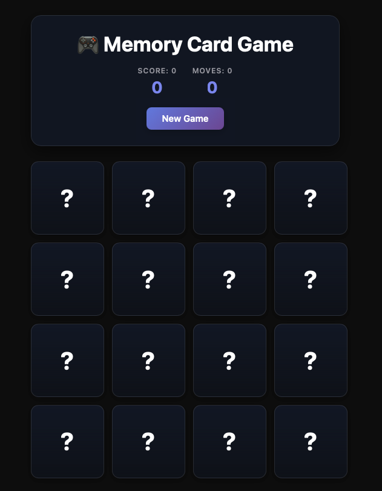

# Memory Card Game



Este repositório contém um jogo de memória desenvolvido em React. O objetivo do jogo é encontrar todos os pares de cartas iguais, testando sua memória e atenção. O projeto utiliza Vite para facilitar o desenvolvimento e possui uma interface simples e intuitiva.

## Como executar o projeto

1. Instale as dependências:
	```sh
	npm install
	```
2. Inicie o servidor de desenvolvimento:
	```sh
	npm run dev
	```
3. Acesse o jogo no navegador pelo endereço exibido no terminal (geralmente http://localhost:5173).